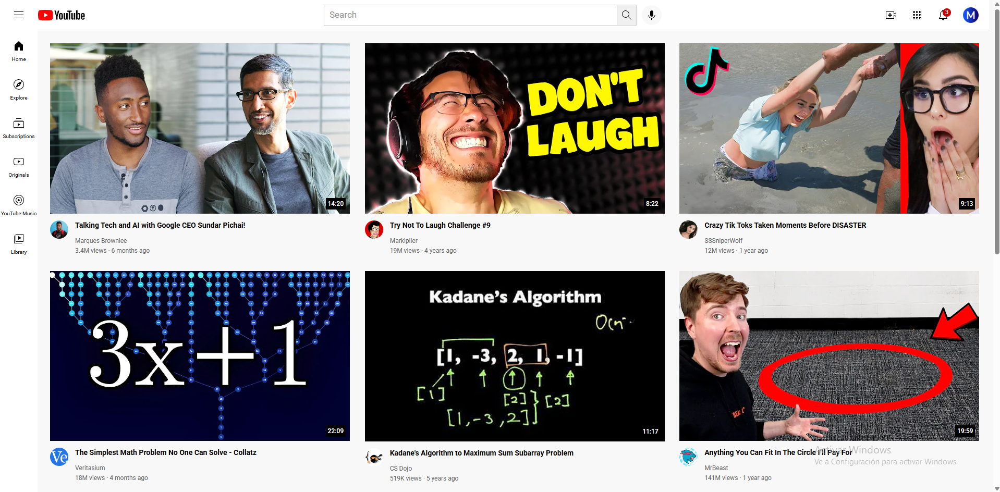

# YouTube UI Clone

A pixel-faithful recreation of YouTube's home page layout built with pure HTML and CSS — no JavaScript, no frameworks.

## 📸 Preview



## 🛠️ Built With

- **HTML5** — semantic structure with `<header>`, `<nav>`, `<main>`
- **CSS Grid & Flexbox** — header uses CSS Grid (3-column), video grid uses responsive CSS Grid
- **CSS-only tooltips** — hover interactions without a single line of JavaScript
- **Google Fonts** — Roboto, same as the real YouTube

## ✨ Features

- Responsive grid: 1 column (mobile) → 2 columns (tablet) → 3 columns (desktop)
- Functional search bar UI with focus state
- Hover tooltips on header icons
- Notification badge on bell icon
- 16:9 aspect-ratio preserved on all thumbnails
- CSS split into components: `header.css`, `sidebar.css`, `videos.css`

## 🚀 Run Locally

No build step needed.

```bash
git clone https://github.com/marcbenju/youtube-ui-clone
cd youtube-ui-clone
# Open index.html in your browser
```

Or just open `index.html` directly — it works without a server.

## 🔧 What I'd Improve

- Add `alt` attributes to all images for accessibility
- Make the sidebar collapsible with JavaScript
- Add hover preview animation on thumbnails
- Replace hardcoded video data with a JSON file + JS rendering

## 📌 Context

This is a foundational exercise completed while learning HTML & CSS. The goal was to replicate a real-world UI to understand layout systems, component structure, and responsive design before moving on to JavaScript.
